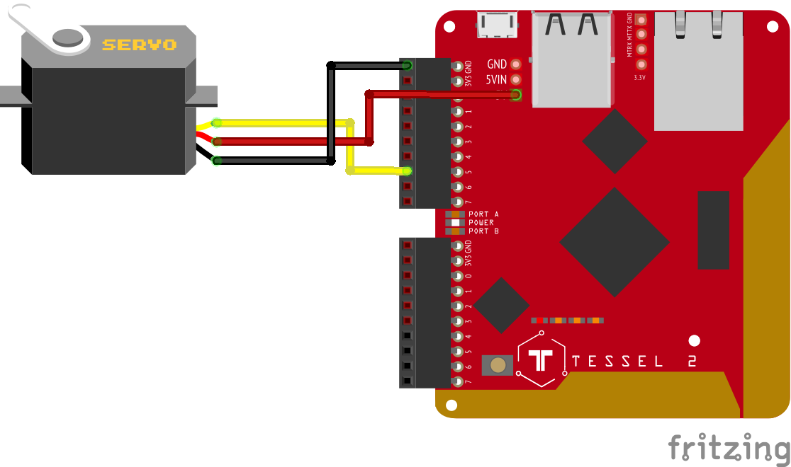

# t2-react-test

A simple application that shows how to:

* Serve a React application off of a Tessel 2
* Connect to it over http to send commands
* Run a servo off a Tessel 2 without the servo board

This is associated with a [quick walkthrough](https://gist.github.com/jherr/26aa7c04a3bfe14a81ae94ab59497bdd) on setting up React for the Tessel 2.

## Wiring



## Project setup
```
yarn install
```

### Local development
```
yarn
```

### Release build and upload to Tessel 2
```
yarn tessel:run
```
